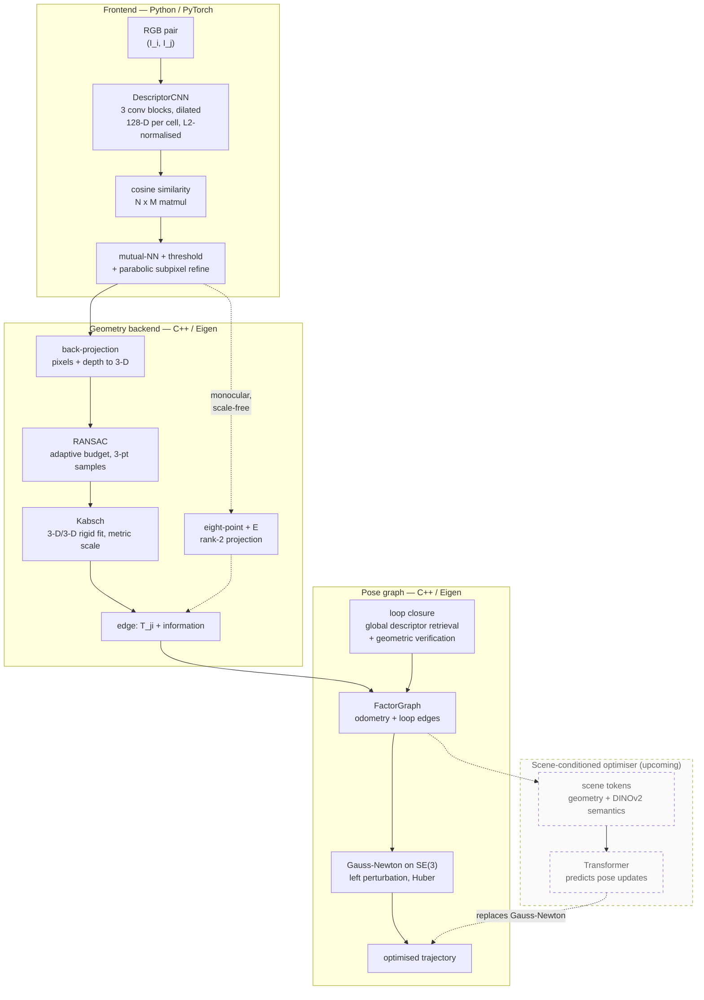

# learned_visual_pose

Relative camera pose from RGB-D image pairs, built from scratch: a learned
descriptor trained with a contrastive objective, feeding a C++ geometry backend
that solves for pose and optimises a pose graph.

Nothing in the geometry path calls OpenCV or GTSAM. SO(3), SE(3), the pinhole
model, the eight-point algorithm, Kabsch, RANSAC and Gauss-Newton on the SE(3)
manifold are implemented directly against Eigen and exposed to Python through
pybind11. Classical solvers appear only as comparison baselines.

## Pipeline



Solid edges are implemented; dashed edges are alternative or upcoming paths.

The eight-point/essential path also exists, kept as the monocular baseline; it
recovers translation only up to scale and is degenerate on planar scenes, which
is why the metric RGB-D route is the production one.

## Current state

**Descriptor — done.** Matching accuracy on a held-out sequence, identical
harness and data across rows, only the descriptor differs:

```
                  MMA@1   MMA@3   MMA@4   MMA@8  MMA@12  MMA@16   median
SIFT (OpenCV)     2.27%  20.14%  32.69%  58.20%  66.96%  71.64%    6.0px
CNN trained       3.59%  30.97%  48.76%  70.74%  73.76%  74.96%    4.1px
```

Receptive field dominated every other architectural choice by an order of
magnitude: reach 15 to 79 px was worth +40 points of MMA@8, where every other
knob moved it by under 2.

**Odometry — done, and good.** Per-edge median 0.10–0.11 deg rotation and
0.27–0.42 cm translation across sequences, chained with no ground truth
anywhere.

**Loop closure and the pose graph — working, and worth between −48% and +2%.**
Four TartanAir sequences, keyframe gap 2, identical settings (the current
`Config` defaults):

| | closures | closure err p50 | odometry ATE | after graph | |
|---|---|---|---|---|---|
| P001 | 29 | 0.26 deg | 0.344 m | 0.179 m | **−48.0%** |
| P006 | 153 | 0.23 deg | 0.374 m | 0.257 m | **−31.2%** |
| P000 | 71 | 0.23 deg | 1.056 m | 1.019 m | −3.5% |
| P002 | 50 | 0.20 deg | 0.991 m | 1.012 m | **+2.2%** |

The closures are accurate everywhere — 0.20–0.26 deg median, and the run that
regresses has the *best* closures of the four. What varies is the environment.
Scored from ground-truth poses (`experiments/revisits.py`), a revisit means
camera centres within 3 m and viewing directions within 60 deg:

```
          revisit pairs at span >= 100 kf        closest approach
P000                2449                              0.2 m
P006                 634                              0.2 m
P001                  72                              0.0 m
P002                   0                              6.6 m   (at span >= 50: 113)
```

P002 has no long revisit at all, so every closure it finds is short-span, and
they cost more than they pay. That the same solver and settings span −48% to
+2% on four sequences from one building is the case for a scene-conditioned
optimiser, stated in numbers.

**What is and is not doing work.** Three parameters were swept and the results
recorded in `config.py`:

- `loop_max_dist = 2.0` is load-bearing. Relaxing it to 5 m on P000 admits
  closures with a median translation error of 1.11 m and takes ATE to 4.151 m.
- `loop_max_candidates` has an optimum, not a monotone: on P006, 25 candidates
  give 0.291 m, 500 give 0.257 m, 3000 give 0.303 m. The excess closures are
  still accurate — they stack on the same revisit event, their information
  matrices sum as though independent, and the graph over-trusts the loop.
- `huber` is inert (identical ATE at 0, 2, 5). There are no outlier closures to
  suppress; the failure mode that bites is correlation, which a robust kernel
  cannot see.

**The global descriptor does not work.** Retrieval currently contributes
nothing measurable: pooled fingerprints score every eligible pair between 0.97
and 0.99 cosine, so `loop_retrieval_similarity` at 0.94 and 0.98 produce
byte-identical runs and precision equals the 5.2% base rate. The closures above
are found by proposing candidates across span bands and letting geometric
verification discriminate. A pooled InfoNCE descriptor is the wrong tool —
the objective makes corresponding patches match, which is not the same as
making an image a place signature. That is the open frontend problem.

102 unit tests over the C++ geometry and graph code.

## Where this is going — a scene-conditioned pose graph Transformer

Replace Gauss-Newton with a network that refines a noisy trajectory the way a
solver does, plus a prior a solver cannot have: what environments usually look
like.

The token stack is a factor graph flattened into a sequence — pose tokens are
variable nodes, edge tokens are factor nodes, attention is message passing. One
token per keyframe (point-set summary, flattened pose, positional encoding), one
per loop closure (measurement, information matrix, both endpoints' encodings),
and a single learned `[SCENE]` token that attention fills with a summary of the
whole graph. Roughly 130 tokens, d_model 256, 6 pre-LN blocks, ~5M parameters.
The output head is zero-initialised, so an untrained model is the identity on the
trajectory it is given.

Per-point channels carry structure as camera-frame xyz, place identity as
descriptor *similarities* injected as attention bias (descriptor space is defined
only up to rotation, so similarity is the invariant content), and semantics as
frozen DINOv2 patch features — measured necessary, because a contrastively
trained matching descriptor carries no category structure by design.

Calibrated expectations: Gauss-Newton and GTSAM compute the exact MAP on clean
Gaussian graphs, so *matching* them there is the success criterion, not beating
them. The winnable ground is robustness to false loop closures, scene priors on
structured environments, and wall-clock.

## Layout

| path | contents |
|---|---|
| `cpp/geometry` | SO(3), SE(3), pinhole camera, eight-point, Kabsch, RANSAC |
| `cpp/pose_graph` | factor graph, g2o I/O, Gauss-Newton |
| `cpp/bindings` | pybind11 glue — no maths, and `geometry` never includes pybind |
| `cpp/tests` | GoogleTest, including degeneracy characterisation |
| `python/visual_pose` | descriptor model, training, matching, app pipeline |
| `experiments` | measurement scripts and figures |
| `geometry_conventions.md` | frames, twist ordering, perturbation side |

## Build

Requires CMake 3.20+, Eigen 5.0+, Python 3.11+.

```bash
pip install -e ".[dev]"                       # builds the extension in place
cmake --build cmake-build-debug --target unit_tests -j 8
./cmake-build-debug/unit_tests
```

`editable.rebuild` recompiles the C++ on import, so editing the backend needs no
reinstall.

## Data

Trained and evaluated on [TartanAir](https://theairlab.org/tartanair-dataset/),
which supplies RGB, depth and ground-truth poses. Depth and poses generate
correspondence labels during training and are withheld at inference.

```bibtex
@article{tartanair2020iros,
  title =   {TartanAir: A Dataset to Push the Limits of Visual SLAM},
  author =  {Wang, Wenshan and Zhu, Delong and Wang, Xiangwei and Hu, Yaoyu and
             Qiu, Yuheng and Wang, Chen and Hu, Yafei and Kapoor, Ashish and
             Scherer, Sebastian},
  booktitle = {2020 IEEE/RSJ International Conference on Intelligent Robots and
               Systems (IROS)},
  year =    {2020}
}
```
